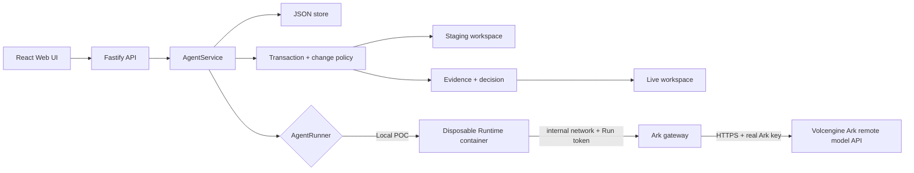

# Architecture

Airlock is a single-node transactional Agent control plane for hackathon use.



## Components

### Web UI

Lists Agents, manages lifecycle actions, submits prompts, and polls asynchronous
Runs. It never receives the Ark API key.

### Fastify API

Validates requests, protects remote demos with a shared bearer token, and
serves the compiled Web UI. The token is not user identity or authorization.

### AgentService

Coordinates lifecycle state, persistence, staged workspaces, and Runs. One
Agent can have only one active or review-pending Run.

```text
ready -> busy -> review -> ready
  |       |        |
  v       v        v
stopped  error   stopped
```

Interrupted Runs become `cancelled` after a restart.

### Storage

```text
data/launchpad.json       Agent, message, and Run metadata
workspaces/AgentID/       Agent-created files
workspaces/.deleted/      Archived deleted workspaces
workspaces/.transactions/ Per-Run staging workspaces
workspaces/.rollback/     Recoverable promotion copies
codex-home/AgentID/       Private Codex configuration and sessions
```

`JsonStore` serializes writes and atomically replaces one JSON file. It supports
one process only.

### Runtime providers

- `ContainerCodexRunner` starts one disposable Docker, Colima, or Podman
  container for every guarded turn.

Guarded execution fails closed instead of falling back to `CodexRunner`. The
container receives staging and one Agent session home only, a read-only root,
bounded `/tmp`, resource limits, dropped capabilities, and
`no-new-privileges`. Approval refuses a changed live digest.

This is Architecture B: Codex acts autonomously inside the Runtime. There is no
pre-tool interceptor.

### Ark gateway and network boundary

Supported POC and host-deployment startup paths default to `ark-gateway` mode.
They create a per-instance Docker/Podman network using `--internal`. Agent
Runtime containers join only that network, so they have no default route to the
public internet. A startup negative check fails closed if a Runtime peer can
reach a public test destination.

The gateway container joins both the internal Runtime network and an external
bridge. It is an application-level forwarder, not an IP router: it accepts only
`POST /api/v3/responses...`, verifies an HMAC-signed Run token and forwards to
the fixed `ARK_BASE_URL` with the real Ark key. The token carries policy, Run,
Agent and expiry identifiers. Request bodies and tokens are never logged.

`current-bridge` is an explicit compatibility mode for npm, GitHub or other
external tools. In that mode the Runtime again has broad egress and receives
the real Ark key, which is displayed as a weaker network policy in evidence.

## Deployment profiles

| Profile | Control plane | Agent execution |
| --- | --- | --- |
| Local POC | Host Node.js | Disposable container on an internal network, plus Ark gateway |
| ECS / Compose without a container engine | Application container | Guarded Runs fail closed |
| Host deployment | systemd Node.js service | Disposable container plus persistent Ark gateway |

## Extension seams

| Track | Primary seam | Expected change |
| --- | --- | --- |
| Glass Box | `AgentRunner`, `AgentRun` | Emit and display correlated execution events. |
| Bouncer | API routes, Agent ownership | Add identity and server-side authorization. |
| Kill Switch | `AgentRunner` | Add threat-specific policy or a stronger sandbox. |

The disposable Runtime container is the POC execution boundary. Ordinary
containers are not hardened multi-tenant isolation.
